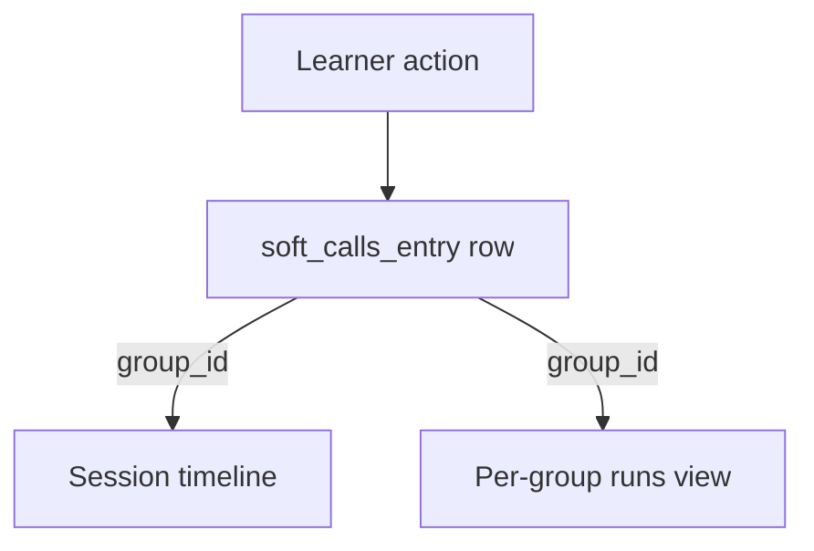
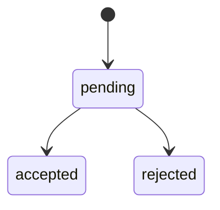
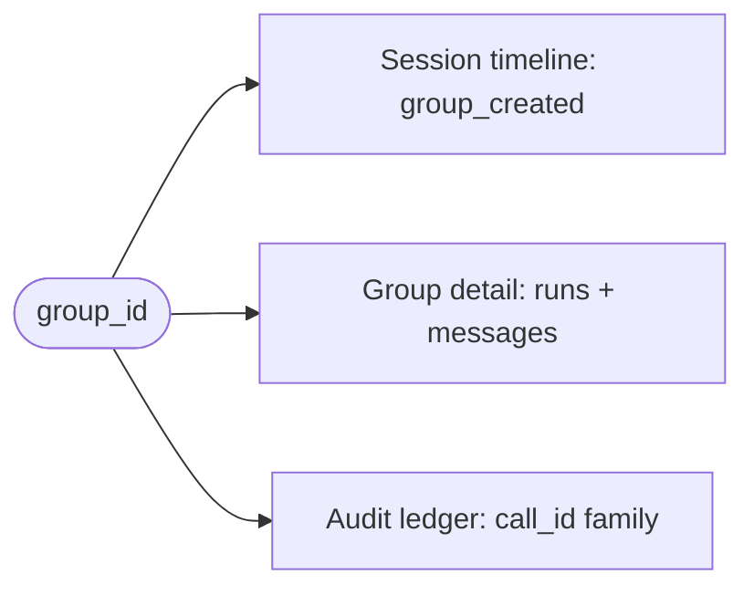

# Audit & Lineage



*One learner action becomes a `soft_calls_entry` row, stitched back through `group_id` into the session timeline and the per-group runs view.*

Glow records every mutation that crosses the wire as an append-only
ledger row, then stitches those rows back through `group_id` into
the [Session](/session) timeline and the [Group](/group) detail tree.
This is the write-side discipline that powers post-hoc
"what actually happened" inspection, FERPA review, and replay of
failed invocations.

Audit is not a public endpoint — it is a framework wrapper that every
mutation route runs through. Drilling the trail is done via the
existing system endpoints documented on
[Activity](/activity), [Session](/session), and [Group](/group).

## What gets audited

Every artifact mutation routed through
`run_artifact_operation_with_audit` participates in audit. The wrapper
does three things in order, regardless of whether the operation has a
registered tool:

1. Emits a `{artifact}.{operation}.started` event onto the internal
   socket bus (forwarded to clients by `ws/output/`).
2. Invokes the runner — the actual mutation closure.
3. Emits `{artifact}.{operation}.completed` on success, or
   `{artifact}.{operation}.failed` on error, with the same `call_id`
   as the `.started` event.

When the tool graph resolves a tool for the `(artifact, operation)`
pair, the wrapper additionally writes a tool-call audit row and may
append a `soft_calls_entry` ledger row from inside the runner.

Reads are **not** audited. Cache hits, websocket replays, and the
SSE relay path do not produce ledger rows.

## The soft_calls_entry shape



*Each `soft_calls_entry` carries the wire-level `call_id` plus an `artifact`/`operation` pair; its `status` moves pending → accepted | rejected.*

The ledger lives in `public.soft_calls_entry` and is **insert-only** —
state transitions are recorded as new rows, never updates. A companion
materialized view `soft_calls_mv` collapses to the latest row per
`call_id` for fast lookups.

| Column | Type | Notes |
|---|---|---|
| `id` | `uuid` | Primary key, defaulted to `uuidv7()` so rows sort by insertion time. |
| `call_id` | `uuid` | The wire-level identity carried on `.started` / `.completed` / `.failed`. |
| `artifact` | `text` | Mirrors `permissions_resource.artifact` (e.g. `persona`, `agent`). |
| `operation` | `text` | The operation key (e.g. `create`, `update`, `delete`). |
| `status` | `text` | One of `pending`, `accepted`, `rejected` (enforced by check constraint). |
| `artifact_id` | `uuid` | The row this call mutates / proposes to mutate. |
| `patch` | `jsonb` | Proposed change payload (nullable). |
| `active` | `boolean` | `false` hides the row from `soft_calls_mv` without deleting it. |
| `mcp` | `boolean` | `true` when the call originated from an MCP tool surface. |
| `generated` | `boolean` | `true` when written by the framework, `false` for hand-seeded rows. |
| `created_at` | `timestamptz` | Defaulted to `now()`. |

Vocabulary mirrors `permissions_resource`: the `(artifact, operation)`
pair is the canonical identifier across the tool graph, the audit
ledger, and the permissions table.

### Append-only state transitions

A soft tool call lifecycle looks like:

```
INSERT … status='pending'   ← LLM proposes a change
INSERT … status='accepted'  ← user confirms (or the runner auto-accepts)
```

or:

```
INSERT … status='pending'
INSERT … status='rejected'  ← user declines, no further writes
```

`soft_calls_mv` returns only the latest row per `call_id`, so
consumers see one logical state. Historic transitions are recoverable
by reading the base table directly.

## group_id stitches audit, session, and group



*A single `group_id` resolves three ways — a timeline event, the group-detail tree, and the call_id family in the ledger.*

Every audit row, every run, and every timeline event carries a
`group_id`. That single id is the join key across the three views:

```
                       session_id
                           │
                           ▼
                ┌─────────────────────┐
                │  Session (timeline) │
                └──────────┬──────────┘
                           │  groups[]
                           ▼
                   group_id ──────────────┐
                       │                  │
        ┌──────────────┴───────────┐      │
        ▼                          ▼      ▼
  ┌──────────┐              ┌──────────────────────┐
  │  Group   │              │  soft_calls_entry    │
  │  (runs + │              │  (one row per        │
  │ messages)│              │   mutation call_id)  │
  └──────────┘              └──────────────────────┘
```

The framework guarantees stitching by:

- **Minting `group_id` early** — routes that create-the-group set
  `mint_group_id_if_missing=True`, which consults the active-group
  Redis cache (so `/context`, `/group`, `/search` firing in parallel
  converge on the same id via `SET NX EX`) and materializes the
  `groups_entry` row before the first event fires. Without this the
  `.started` event would carry `group_id=None` and SSE would drop it.
- **Reusing `call_id` across `.started` / `.completed` / `.failed`** —
  one wire-level id per invocation, threaded through both the event
  payloads and the audit row's primary key via `pre_minted_call_id`.
- **Carrying `operation_key`** — a stable per-step identifier (see
  [Idempotency + replay safety](#idempotency--replay-safety) below).

## Reading the audit trail

{/* DEMO_VIDEO: audit-replay | playwright */}

<DemoVideo
  topic="audit-replay"
  kind="playwright"
  caption="Drilling top-down: Activity → pick a session → Session timeline → click a group_created row → Group detail with runs + messages → individual call_id back to the ledger."
/>

The audit trail is not exposed as its own endpoint — the existing
system endpoints already surface the relevant slices. The canonical
drill chain is:

| Step | Surface | Endpoint | Carries |
|---|---|---|---|
| 1. Engagement | [Activity](/activity) | `POST /system/activity` | `sessions_count`, per-profile breakdown |
| 2. Session pick | [Activity](/activity) | `POST /system/sessions` | `session_id` per row |
| 3. Session detail | [Session](/session) | `POST /system/session` | `groups[]` + `timeline[]` |
| 4. Group detail | [Group](/group) | `POST /system/group` (`include_detail: true`) | `runs[]` + `messages[]` with `calls[]` |
| 5. Receipt | filesystem | call JSON receipt (`call_upload_id`) | full `started` / `completed` / `failed` event log |

Each step narrows the time window and the entity set. The Group
endpoint's lean mode (`include_detail: false`) is the cheap path used
by the audit-linking middleware — it returns identity only, enough to
hyperlink a `group_id` back to its session without paying for the full
runs + messages tree.

The Group page already documents the runs and messages shape; see
[Group → Understanding the detail response](/group#understanding-the-detail-response).

## Idempotency + replay safety

Two ids work together to make audited calls safe to re-fire:

- **`call_id`** — minted per invocation. Identifies one specific
  attempt. Different attempts of the same logical operation get
  different `call_id`s.
- **`operation_key`** — stable across attempts of the same logical
  step. Carried on the wire alongside `call_id`, and persisted on the
  audit row.

`calls_entry.operation_key` is the canonical replay key. When a
runner fails partway (network drop, model timeout, a downstream 500),
re-firing the *same* `operation_key` lets the framework detect the
duplicate, short-circuit any already-written soft-call rows, and
resume from the failure point without producing a second ledger
entry. The test picker fan-out uses this mechanism to safely retry
individual calls inside a larger replay without re-running the calls
that already succeeded.

`idempotency_key` is the wider deduplication contract — passed in by
callers that need exactly-once semantics across long retry windows.
The framework's earlier brittle assumption that `idempotency_key ==
artifact_id` is gone; the soft_calls ledger is now the source of
truth.

## What audit does NOT cover

The audit wrapper is the canonical entry point, but it is not the
only path that emits events. Be precise about its limits:

- **Direct `internal_sio.emit(...)` calls** — handlers that bypass
  `run_artifact_operation_with_audit` and emit events themselves
  produce wire traffic without a ledger row. The catch-all forwarder
  in `ws/output.py` still relays them to clients, but no
  `soft_calls_entry` is written.
- **Read endpoints** — `POST /<artifact>/get`, `/<artifact>/search`,
  and the various `*_download` routes never participate in audit.
  There is no "who read this" trail.
- **Cache hits** — when `bypass_cache=False` and the resolver returns
  a cached result, no runner runs, so no events fire and no ledger
  row is written. The original ledger row from the call that
  populated the cache is the only audit trail.
- **MV reads** — querying `soft_calls_mv` (e.g. through the search
  endpoint) is itself a read, not an audited write.
- **Failed pre-flight** — when `run_artifact_operation_with_audit`
  raises in `resolve_common_context` (profile not found, permission
  denied), the wrapper exits before any event fires. The failure is
  observable in application logs but not in the ledger.

If a write needs auditing, the answer is always to route it through
`run_artifact_operation_with_audit` — adding ad-hoc ledger inserts
elsewhere fragments the source of truth.

## Related

- [Activity](/activity) — aggregate engagement counts, the entry point for the drill chain.
- [Session](/session) — per-session timeline and groups list.
- [Group](/group) — per-group runs, messages, and `calls[]` references.
- [API Reference](/api-reference) — full system endpoint schemas.
